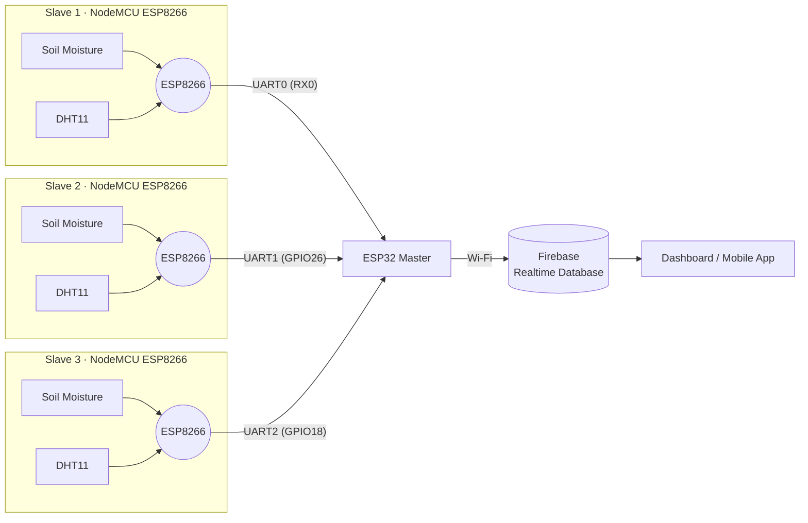

# 🌱 AgroBot: Multi-Node Soil Monitoring with ESP8266, ESP32 & Firebase

A distributed soil monitoring system where several **NodeMCU (ESP8266)** sensor nodes measure soil moisture, air temperature and humidity, send their readings over **UART** to a single **ESP32 master node**, which then uploads everything to **Firebase Realtime Database**.

<!-- Add a photo of your setup here -->
<!--  -->

---

## 📋 Table of Contents

- [Features](#-features)
- [System Architecture](#-system-architecture)
- [Hardware Required](#-hardware-required)
- [Wiring](#-wiring)
- [Software & Libraries](#-software--libraries)
- [Firebase Setup](#-firebase-setup)
- [Installation](#-installation)
- [Data Format](#-data-format)
- [Firebase Database Structure](#-firebase-database-structure)
- [Troubleshooting](#-troubleshooting)
- [Limitations & Future Work](#-limitations--future-work)
- [License](#-license)

---

## ✨ Features

- Three independent sensor nodes, each with a soil moisture sensor and a DHT11
- Wired UART link from every slave to the master, so no extra radio setup is needed on the slaves
- ESP32 uses its three hardware UARTs to listen to all slaves at once
- Readings pushed to Firebase Realtime Database under a separate path for each node
- Anonymous Firebase authentication with automatic token refresh and Wi-Fi reconnection

---

## 🏗 System Architecture



**How it works**

1. Each ESP8266 reads its soil moisture sensor and DHT11 at a fixed interval.
2. The slave sends the readings as one comma-separated line over its TX pin.
3. The ESP32 listens on three UART ports, one per slave, and parses the incoming line.
4. The parsed values are written to Firebase under `Slave1`, `Slave2` and `Slave3`.

---

## 🔧 Hardware Required

| Component | Quantity | Notes |
|---|---|---|
| ESP32 Dev Board | 1 | Master node |
| NodeMCU ESP8266 | 3 | Slave nodes |
| DHT11 Temperature & Humidity Sensor | 3 | One per slave |
| Soil Moisture Sensor (analog) | 3 | Capacitive type recommended for longevity |
| Jumper wires | — | Keep UART runs short |
| 5V power supply / USB cables | 4 | One per board |

---

## 🔌 Wiring

### Slave Node (NodeMCU ESP8266)

| Sensor | Sensor Pin | NodeMCU Pin |
|---|---|---|
| DHT11 | VCC | 3V3 |
| DHT11 | DATA | D2 (GPIO4) |
| DHT11 | GND | GND |
| Soil Moisture | VCC | 3V3 |
| Soil Moisture | AOUT | A0 |
| Soil Moisture | GND | GND |

### Slave → Master UART Connections

| Slave | Slave TX | ESP32 RX | ESP32 UART |
|---|---|---|---|
| Slave 1 | TX | GPIO3 (RX0) | `Serial` |
| Slave 2 | TX | GPIO26 | `Serial1` |
| Slave 3 | TX | GPIO18 | `Serial2` |

> ⚠️ **Connect GND of every slave to GND of the ESP32.** UART will not work without a common ground.
>
> Both boards use 3.3V logic, so no level shifter is needed.

<!-- Add your circuit diagram here -->
<!--  -->

---

## 💻 Software & Libraries

- [Arduino IDE](https://www.arduino.cc/en/software) (or PlatformIO)
- **ESP32 board package**: add `https://raw.githubusercontent.com/espressif/arduino-esp32/gh-pages/package_esp32_index.json`
- **ESP8266 board package**: add `http://arduino.esp8266.com/stable/package_esp8266com_index.json`

Install through **Sketch → Include Library → Manage Libraries**:

| Library | Author | Used on |
|---|---|---|
| Firebase Arduino Client Library for ESP8266 and ESP32 (`Firebase_ESP_Client`) | Mobizt | ESP32 master |
| DHT sensor library | Adafruit | ESP8266 slaves |
| Adafruit Unified Sensor | Adafruit | ESP8266 slaves (dependency) |

---

## 🔥 Firebase Setup

1. Go to the [Firebase Console](https://console.firebase.google.com/) and create a new project.
2. Open **Build → Realtime Database** and click **Create Database**. Pick a region and start in test mode.
3. Open **Build → Authentication → Sign-in method** and enable **Anonymous**.
4. Open **Project Settings → General** and copy the **Web API Key**.
5. Copy the database URL from the Realtime Database page, for example `https://your-project-default-rtdb.region.firebasedatabase.app/`.

> 🔒 Test mode leaves the database open. Before any long-term deployment, set proper [security rules](https://firebase.google.com/docs/database/security).

---

## 🚀 Installation

### 1. Clone the repository

```bash
git clone https://github.com/AranyakRoy22/Multiple-Slave-One-Master-Communication
```

### 2. Flash the slave nodes

1. Open `Slave_8266/Slave_8266.ino`.
2. Select **Tools → Board → NodeMCU 1.0 (ESP-12E Module)**.
3. Upload to each of the three NodeMCUs.

> Disconnect the slave's TX wire from the ESP32 while uploading.

### 3. Configure and flash the master node

1. Open `master_node_multi_slave_ESP32_Firebase/master_node_multi_slave_ESP32_Firebase.ino`.
2. Fill in your credentials:

```cpp
#define WIFI_SSID     "YOUR_WIFI_SSID"
#define WIFI_PASSWORD "YOUR_WIFI_PASSWORD"
#define API_KEY       "YOUR_FIREBASE_WEB_API_KEY"
#define DATABASE_URL  "YOUR_FIREBASE_DATABASE_URL"
```

3. Select **Tools → Board → ESP32 Dev Module**.
4. Disconnect Slave 1 from GPIO3 (RX0), since it shares the USB serial port, then upload.
5. Reconnect all slaves and power everything on.

### 4. Check the output

Open the Serial Monitor at **9600 baud** on the ESP32. You should see:

```
Connecting to Wi-Fi.....
Connected with IP: 192.168.x.x

Connected to cloud!
Received data from ESP8266(Slave2): ...
```

Data should now appear live in the Firebase console.

---

## 📦 Data Format

Each slave sends one line over UART at 9600 baud, 8N1:

```
<moisture>,<humidity>,<temperature>
```

| Field | Type | Range | Description |
|---|---|---|---|
| `moisture` | int | 0–1023 | Raw ADC value from the soil moisture sensor |
| `humidity` | float | 20–90 % | Relative humidity from DHT11 |
| `temperature` | float | 0–50 °C | Air temperature from DHT11 |

**Example:** `612,58.00,27.00`

> Raw moisture values depend on the sensor and soil type. With most sensors a **higher value means drier soil**. Calibrate by recording readings in dry air and in water.

---

## 🗄 Firebase Database Structure

```json
{
  "Slave1": {
    "DHT_11": {
      "Temperature":   { "Data": 27 },
      "Humidity":      { "Data": 58 },
      "Soil Moisture": { "Data": 612 }
    }
  },
  "Slave2": { "...": "same structure" },
  "Slave3": { "...": "same structure" }
}
```

<!-- Add a screenshot of your Firebase console here -->
<!--  -->

---

## 🛠 Troubleshooting

| Problem | Possible cause and fix |
|---|---|
| Stuck on `Connecting to Wi-Fi...` | Wrong SSID or password. The ESP32 only supports **2.4 GHz** networks. |
| Firebase sign-up error | Anonymous sign-in is not enabled, or the API key or database URL is wrong. |
| No data from a slave | Check TX → RX wiring and **common GND**. Confirm both sides use 9600 baud. |
| Garbage characters on first boot | The ESP8266 prints boot messages at 74880 baud. The first message after reset can be ignored. |
| `Failed to read from DHT sensor!` | Loose DHT11 wiring or wrong data pin. A 10 kΩ pull-up on DATA can help. |
| Moisture always 0 or 1023 | The sensor must be on **A0**, the only analog pin on the ESP8266. |
| Upload fails on ESP32 | Disconnect Slave 1 from RX0 while flashing. |

---

## 🧭 Limitations & Future Work

**Current limitations**

- The ESP32 has three hardware UARTs, so this wired design supports up to **three** slaves. Slave 1 also shares UART0 with the USB serial monitor.
- Each value is overwritten in Firebase, so there is no history.
- Slaves must be physically wired to the master.

**Ideas for improvement**

- [ ] Replace UART with **ESP-NOW** for wireless links and more than three slaves
- [ ] Store timestamped readings for historical graphs
- [ ] Add NPK and pH sensors
- [ ] Deep sleep on slave nodes for battery or solar operation
- [ ] Web or mobile dashboard for live visualization
- [ ] Automatic irrigation control based on moisture thresholds

---

## 📁 Repository Structure

```
.
├── master_node_multi_slave_ESP32_Firebase/
│   └── master_node_multi_slave_ESP32_Firebase.ino
├── Slave_8266/
│   └── Slave_8266.ino
├── images/
└── README.md
```

---
